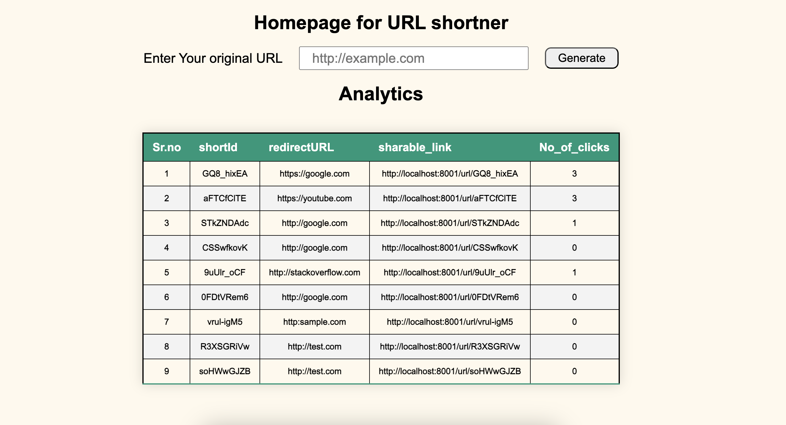

# URL Shortner

This is a simple website that takes any URL and returns a short url. It also provides analytics about all the short urls generated , incase if you forget!

## 🚀 Features 

- **URL shortner service** : provides a short url for the given url.
- **Analytics** : provides analytics for number of clicks on the url.

## ⏳ Features comming soon 

- **QR code generation** : you will be able to generate QR code for the urls.

## Screenshots 



## 🤔 Why to create and use short URL?

Short URLs are useful because they are easier to share, read, and remember. They can also help you track how many people clicked on your link

### Why are short URLs useful?

- **Easier to share** : Short URLs are easier to copy and paste into social media posts, emails, and presentations. 
- **Easier to read** : Short URLs are easier to read than long URLs, which can be hard to decipher. 
- **Easier to remember** : Short URLs are easier to remember than long URLs. 
- **More aesthetically pleasing**: Short URLs look better than long URLs, which can look suspicious. 
- **Tracking**: URL shortener tools can track how many people clicked on a link, where they are from, and how long they stayed on the page.


### Use cases for short URLs

- **Social media**: Short URLs are great for sharing links on social media platforms like Instagram, LinkedIn, and TikTok. 
- **Marketing**: Short URLs can be used to generate QR codes that can be printed on products, stickers, and more. 
- **Tracking user engagement**: Short URLs can be used to track how users engage with content on a link


## Tech stack 

- **backend** : Nodejs , express , mongodb 
- **frontend/views** : ejs(Embedded JavaScript templating)


## 💻 Installation

1. Clone the repo 
```
git clone ...
```

2. create a ``.env`` file and add your  ``MONGODB_URI`` either local or cloud based.

3. Run the project 
```
npm start
```

4. Open the project 
```
http://localhost:8001
```


## 🐛 Report Issues

If you find any bugs or have suggestions for enhancements, feel free to open an issue.

